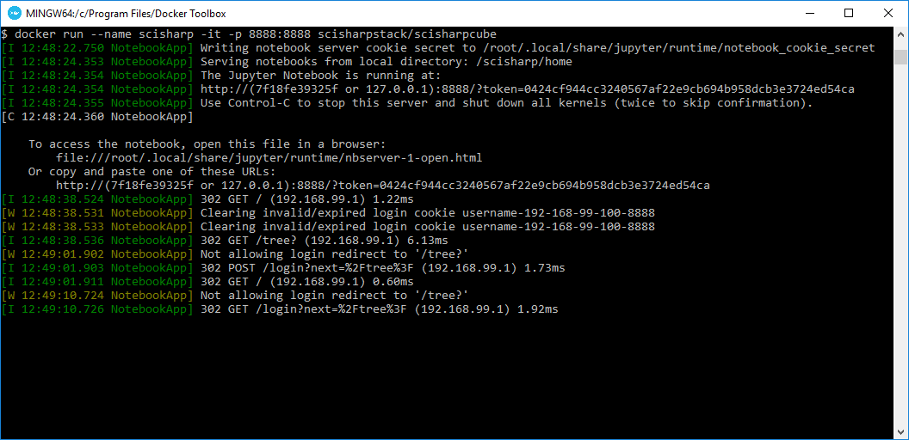
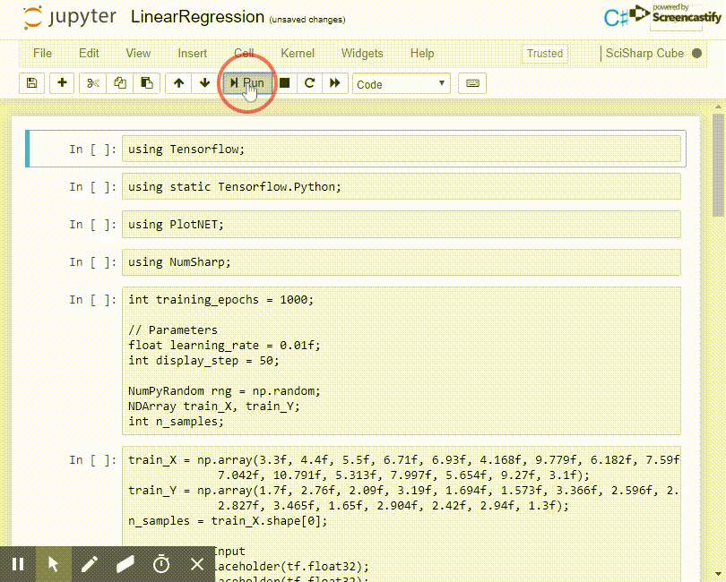

# SciSharp Cube
Quickly experience all the latest features of SciSharp Machine Learning tools in docker container.

### Run from Docker Hub

```shell
docker run --name scisharp -it -p 8888:8888 scisharpstack/scisharpcube
```

This command will pull latest [SciSharpCube](<https://hub.docker.com/r/scisharpstack/scisharpcube>) image and run it.



There is an example of Linear Regression.




### Build image from local

##### Get source code

```shell
git clone https://github.com/SciSharp/SciSharpCube
cd SciSharpCube
```
##### Build docker image
```shell
docker build -f ./dockerfiles/cube.dockfile -t scisharpcube .
```
If `microsoft/dotnet` is not pulled automatically, you should run `docker pull microsoft/dotnet` first.
##### Start a container
```shell
docker run --name scisharp -it -p 8888:8888 scisharpcube
```
Now you can open the Jupyter link printed out in the console in your browser. Congratulations, 
you are running SciSharp STACK in Jupyter

##### Tips (not necessary)
If you want to open another shell.
```shell
docker exec -it scisharp bash
```
If you ever exit the container with Control-C you can re-enter it with the following command.

```shell
docker start scisharp -i
```
